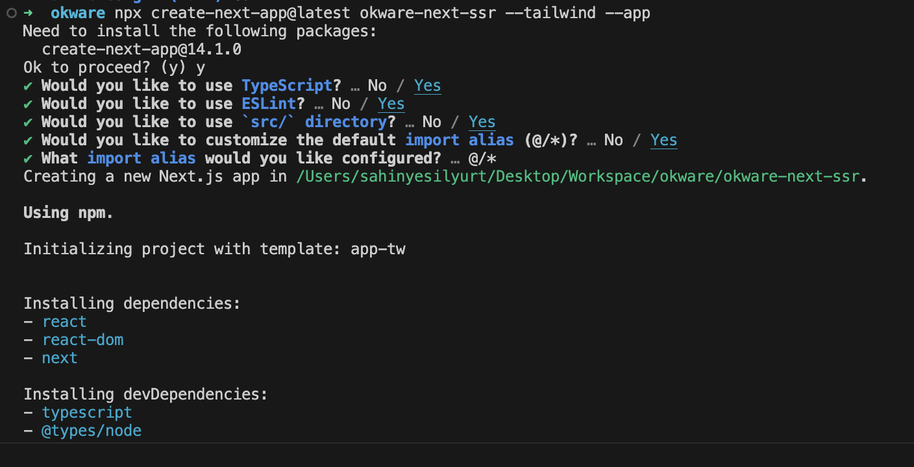
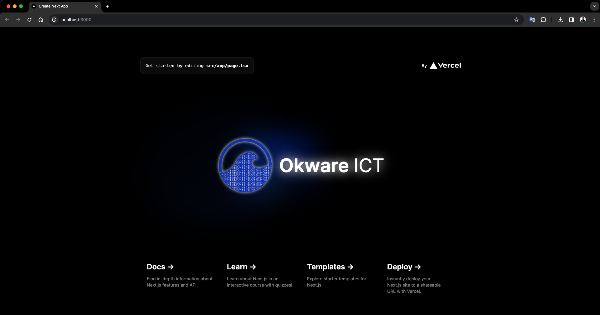

# ⚙️ Deploy Next.JS SSR Aplications to AWS with Github Actions

### 👋 Merhaba Ben Okware.dev'den **Şahin**, 

Bu yazımda Next.JS SSR uygulmalarımızı Github Actions ve AWS Elastic Beanstalk kullanarak nasıl deploy edeceğimizi elimden geldiğince detaylı bir şekilde anlatmak istiyorum. Başlamadan önce nelere ihtiyaçımız olacak bi göz atalım.

### Gereksinimler
- AWS Hesabı
- Github Hesabı
- Giriş düzeyde Next.JS Bilgisi

### 1. Next.JS Projesi oluşturma

Hızlıca bir Next.JS uygulaması oluşturmak için `create-next-app` paketini kullanabiliriz.
Terminalimizi açarak App router ve tailwind içeren bir next.js uygulaması oluşturmak için
</br> 
</br> 
`npx create-next-app@latest okware-next-ssr --tailwind --app`
</br> 
</br> 
komutunu çalıştırıyoruz. ve çıktımız aşağıdaki gibi oluyor. 
</br> 
</br> 

</br> 

Sonrasında oluşturduğumuz uygulamayı local imizde çalıştırabiliriz.

```sh
cd <project_path>
npm run dev
```
Next.Js SSR uygulamamız `localhost:3000` de çalışıyor. local deki adres sisteminize göre değişkenlik gösterebilir.


### 2. AWS Hesabı ile Elastic Beanstalk da Uygulama ve Enviorment Oluşturma

### 3. Github Actions ile Projemizi build etme ve AWS Deploy Etme

### 4. Kapanış